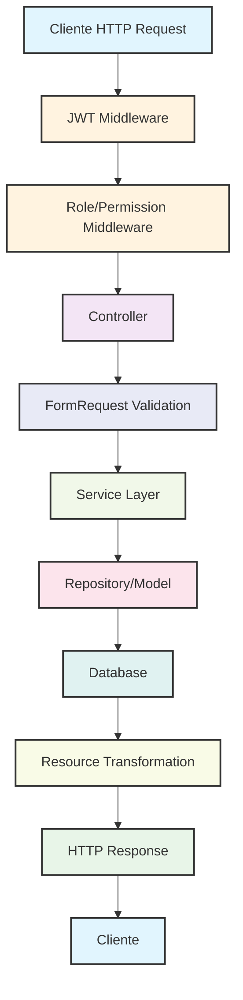

# 🚀 Código Base Laravel 12 - API REST Completa

<p align="center">
  <a href="https://laravel.com" target="_blank">
    
  </a>
</p>

<p align="center">
  <a href="https://github.com/laravel/framework/actions">
    
  </a>
  <a href="https://packagist.org/packages/laravel/framework">
    
  </a>
  <a href="https://packagist.org/packages/laravel/framework">
    
  </a>
  <a href="https://packagist.org/packages/laravel/framework">
    
  </a>
  <a href="https://github.com/litespeedtech/ols-docker-env">
    
  </a>
</p>

## 📖 Descripción

Este repositorio es una **plantilla completa y funcional** para desarrollar APIs REST en Laravel 12. Diseñada con buenas prácticas modernas, incluye autenticación JWT, gestión de roles/permisos, y una arquitectura modular que facilita la escalabilidad. Perfecta para proyectos que requieren seguridad granular, testabilidad y mantenibilidad.

**Características principales:**

- 🔐 Autenticación JWT con `tymon/jwt-auth`
- 🛡️ Sistema de roles y permisos con `spatie/laravel-permission`
- 📊 API RESTful con recursos JSON estandarizados
- 🧪 Tests automatizados con Pest/PHPUnit
- 🐳 Soporte Docker completo (compatible con ols-docker-9paul2)
- 📚 Documentación exhaustiva y ejemplos prácticos

---

## ✨ Características Destacadas

### 🔧 Tecnologías y Paquetes

- **Laravel 12**: Framework moderno con PHP 8.4+
- **JWT Auth**: Autenticación stateless con tokens
- **Spatie Permission**: Gestión avanzada de roles y permisos
- **SQLite/PostgreSQL/MySQL**: Bases de datos flexibles
- **Docker**: Entorno de desarrollo containerizado

### 🏗️ Arquitectura y Patrones

- **Paradigma**: API REST con principios SOLID
- **Patrón Arquitectónico**: MVC extendido con Services/Repositories
- **Patrones de Diseño**:
  - Service Layer: Lógica de negocio encapsulada
  - Repository Pattern: Abstracción de datos
  - Policy Pattern: Autorización granular
  - Resource Pattern: Transformación de respuestas JSON

### 🔄 Flujo de Clases (Request → Response)



Cada módulo (Users, Roles, Permissions, Statuses) sigue este flujo para garantizar consistencia y testabilidad.

---

## 🚀 Quickstart

### Prerrequisitos

- PHP 8.4+
- Composer 2.8+
- Node.js 20+ (opcional para assets)
- Docker (opcional para entorno completo)

### Instalación Rápida

```bash
# Clonar repositorio
git clone https://github.com/tu-usuario/codigo-base-laravel-12.git
cd codigo-base-laravel-12

# Instalar dependencias
composer install
npm install

# Configurar entorno
cp .env.example .env
php artisan key:generate
php artisan jwt:secret

# Migrar y seedear
php artisan migrate --seed

# Ejecutar servidor
php artisan serve
```

### Verificación

```bash
curl -X POST http://localhost:8000/api/v1/auth/login \
  -H "Content-Type: application/json" \
  -d '{"email":"admin@example.com","password":"password"}'
```

---

## 📋 API Endpoints

### 🔐 Autenticación

| Método | Endpoint | Descripción |
|--------|----------|-------------|
| POST | `/api/v1/auth/login` | Iniciar sesión |
| POST | `/api/v1/auth/register` | Registrar usuario |
| POST | `/api/v1/auth/logout` | Cerrar sesión |

**Ejemplo de respuesta - Login:**

```json
{
  "access_token": "eyJ0eXAiOiJKV1QiLCJhbGciOiJIUzI1NiJ9...",
  "token_type": "bearer",
  "expires_in": 3600,
  "user": {
    "id": "01KASSGB071MCJWX0CADW8ZCBK",
    "name": "Admin",
    "email": "admin@example.com"
  }
}
```

### 👤 Usuarios

| Método | Endpoint | Permiso Requerido |
|--------|----------|-------------------|
| GET | `/api/v1/users` | `view users` |
| GET | `/api/v1/users/{ulid}` | `view users` |
| POST | `/api/v1/users` | `create users` |
| PUT | `/api/v1/users/{ulid}` | `edit users` |
| DELETE | `/api/v1/users/{ulid}` | `delete users` |

**Ejemplo de respuesta - Crear Usuario:**

```json
{
  "user": {
    "id": "01KASSGB071MCJWX0CADW8ZCBK",
    "name": "Juan Pérez",
    "email": "juan@example.com",
    "status": {
      "id": 1,
      "nombre": "Activo"
    },
    "created_at": "2025-11-23T12:00:00.000000Z"
  },
  "roles": ["user"],
  "permissions": ["view users"],
  "message": "User created successfully"
}
```

### 👤 Roles

| Método | Endpoint | Permiso Requerido |
|--------|----------|-------------------|
| GET | `/api/v1/roles` | `view roles` |
| POST | `/api/v1/roles` | `create roles` |
| PUT | `/api/v1/roles/{id}` | `edit roles` |
| DELETE | `/api/v1/roles/{id}` | `delete roles` |

### 🔑 Permisos

| Método | Endpoint | Permiso Requerido |
|--------|----------|-------------------|
| GET | `/api/v1/permissions` | `view permissions` |
| POST | `/api/v1/permissions` | `create permissions` |
| PUT | `/api/v1/permissions/{id}` | `edit permissions` |
| DELETE | `/api/v1/permissions/{id}` | `delete permissions` |

### 📊 Estados

| Método | Endpoint | Permiso Requerido |
|--------|----------|-------------------|
| GET | `/api/v1/statuses` | `view permissions` |
| POST | `/api/v1/statuses` | `create permissions` |
| PUT | `/api/v1/statuses/{id}` | `edit permissions` |
| DELETE | `/api/v1/statuses/{id}` | `delete permissions` |

**Nota:** Los IDs de usuario usan ULID para mayor seguridad. Ejemplo: `01KASSGB071MCJWX0CADW8ZCBK`.

---

## 🧪 Testing y Desarrollo

### Ejecutar Tests

```bash
# Todos los tests
php artisan test

# Tests específicos
php artisan test --filter=UserTest
```

### Colecciones Postman

Importa las colecciones desde [`docs/api-testing`](docs/api-testing ):

- `Laravel_API_Permisos_Roles.postman_collection.json`
- `Laravel_API_Environment.postman_environment.json`

### Ejemplo de Request

```bash
# Crear usuario
curl -X POST http://localhost:8000/api/v1/users \
  -H "Authorization: Bearer YOUR_JWT_TOKEN" \
  -H "Content-Type: application/json" \
  -d '{
    "name": "Juan Pérez",
    "email": "juan@example.com",
    "password": "password123",
    "roles": [1],
    "permissions": [1,2]
  }'
```

---

## 📁 Estructura del Proyecto

```text
├── app/
│   ├── Http/
│   │   ├── Controllers/     # Controladores API
│   │   ├── Middleware/      # Middlewares custom (JWT, Roles)
│   │   ├── Requests/        # Form Requests para validación
│   │   └── Resources/       # API Resources para JSON
│   ├── Models/              # Modelos Eloquent
│   ├── Policies/            # Políticas de autorización
│   ├── Services/            # Lógica de negocio
│   └── Traits/              # Traits reutilizables
├── database/
│   ├── migrations/          # Migraciones DB
│   ├── seeders/             # Seeders para datos iniciales
│   └── factories/           # Factories para tests
├── docs/                    # Documentación completa
│   ├── crear-proyecto-laravel.md
│   ├── herramientas-clases.md
│   ├── api-testing/         # Colecciones Postman
│   └── ...
├── routes/
│   ├── api.php              # Rutas API principales
│   ├── users.php            # Rutas específicas por módulo
│   └── ...
├── tests/                   # Tests automatizados
└── docker-compose.yml       # Configuración Docker
```

---

## 🐳 Uso con Docker

Compatible con [ols-docker-9paul2](https://github.com/9paul20/ols-docker-9paul2) para un entorno completo.

```bash
# Desde la raíz del proyecto Docker
cd ../ols-docker-9paul2
docker-compose up -d

# Accede a tu proyecto en sites/PHP/codigo-base-laravel-12
```

---

## 📚 Documentación Adicional

- **[Crear Proyecto Laravel](docs/crear-proyecto-laravel.md)**: Guía paso a paso para replicar este setup
- **[Herramientas y Clases](docs/herramientas-clases.md)**: Referencia completa de componentes Laravel
- **[Mapa Mental](docs/Mapa-Mental-Implementacion.md)**: Flujo de implementación por módulo
- **[Guía de Autorización](docs/Guia_Autorizacion_Middlewares.md)**: Sistema de roles/permisos detallado
- **[Consumo de API](docs/API_Consumption_README.md)**: Guía completa para consumir la API

---

## 🔧 Troubleshooting

### Problemas Comunes

#### ❌ "SQLSTATE[HY000]: General error: 20 datatype mismatch" en migraciones

**Causa:** Problema con ULID en SQLite.
**Solución:**

```bash
# Eliminar base de datos
rm database/database.sqlite

# Recrear archivo vacío
touch database/database.sqlite

# Migrar nuevamente
php artisan migrate:fresh --seed
```

#### ❌ "JWT token expired" o "Token is invalid"

**Causa:** Token JWT expirado (por defecto 1 hora).
**Solución:** Hacer login nuevamente para obtener nuevo token.

#### ❌ "User does not have the right permissions"

**Causa:** Usuario sin permisos requeridos.
**Solución:** Verificar roles y permisos del usuario en la base de datos.

#### ❌ "Class not found" en middlewares

**Causa:** Middlewares no registrados.
**Solución:** Verificar `bootstrap/app.php` o `app/Http/Kernel.php`.

#### ❌ Errores de validación 422

**Causa:** Datos inválidos en request.
**Solución:** Revisar mensajes de error en la respuesta JSON.

### Comandos Útiles para Debug

```bash
# Ver rutas registradas
php artisan route:list --path=api

# Ver middlewares
php artisan route:list --middleware

# Ejecutar solo seeders específicos
php artisan db:seed --class=RolePermissionSeeder

# Ver logs de Laravel
tail -f storage/logs/laravel.log

# Limpiar cache
php artisan config:clear
php artisan cache:clear
php artisan route:clear
```

### Compatibilidad de Versiones

- **PHP:** 8.4+
- **Laravel:** 12.x
- **Composer:** 2.8+
- **Node.js:** 20+ (opcional)
- **SQLite/PostgreSQL/MySQL:** Compatible

---

¡Contribuciones son bienvenidas! Sigue estos pasos:

1. Fork el proyecto
2. Crea una rama (`git checkout -b feature/nueva-funcionalidad`)
3. Commit tus cambios (`git commit -m 'Agrega nueva funcionalidad'`)
4. Push a la rama (`git push origin feature/nueva-funcionalidad`)
5. Abre un Pull Request

### Guías de Contribución

- Sigue PSR-12 para código PHP
- Agrega tests para nuevas funcionalidades
- Actualiza documentación según cambios
- Usa commits descriptivos

---

## 📄 Licencia

Este proyecto está bajo la Licencia MIT. Ver [`LICENSE`](LICENSE) para más detalles.

---

## 🙏 Agradecimientos

- [Laravel Framework](https://laravel.com/) - El mejor framework PHP
- [Tymon JWT Auth](https://github.com/tymon/jwt-auth) - Autenticación JWT
- [Spatie Laravel Permission](https://github.com/spatie/laravel-permission) - Gestión de permisos
- [OpenLiteSpeed Docker](https://github.com/litespeedtech/ols-docker-env) - Entorno Docker

---

## 📞 Soporte

¿Preguntas o problemas? Abre un [issue](https://github.com/tu-usuario/codigo-base-laravel-12/issues) o contacta al maintainer.

**¡Feliz coding!** 🎉

---

*Inspirado en proyectos como [Laravel Breeze](https://github.com/laravel/breeze) y [Laravel Sanctum](https://github.com/laravel/sanctum).*
